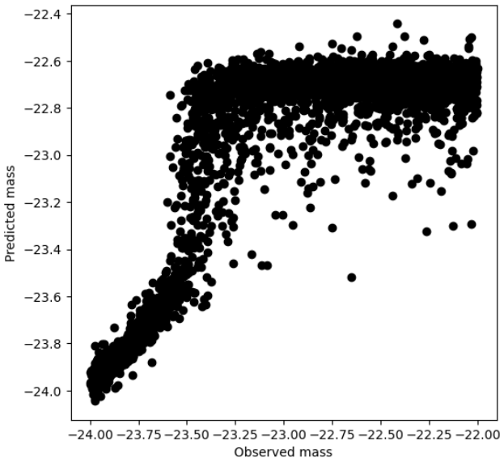
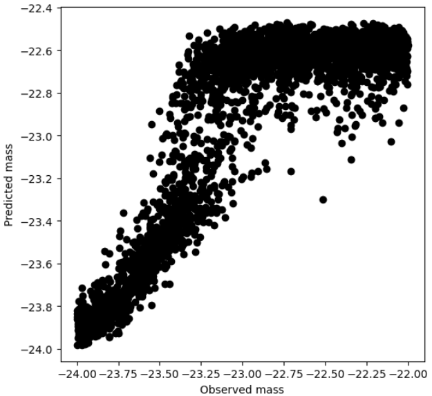
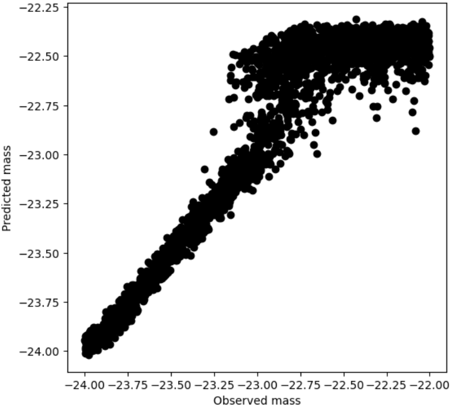
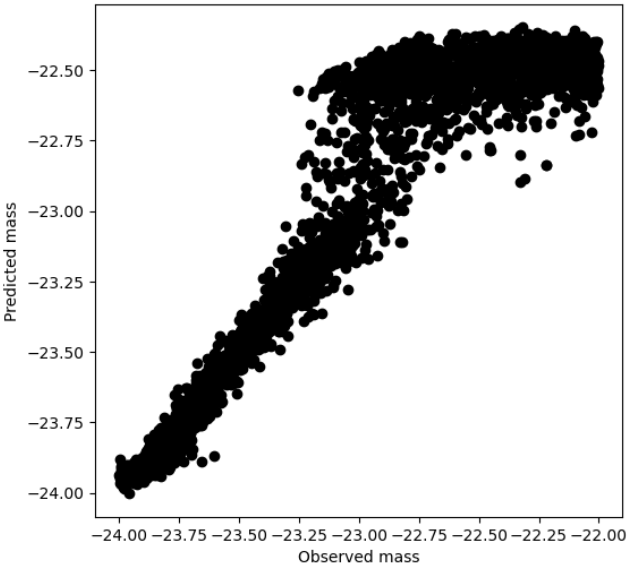

[](https://github.com/Claussss/DeepLense-Regression/blob/main/LICENSE.txt)

# DeepLense Regression

A FastAI-based tool for performing regression on strong lensing images to predict axion mass density of galaxies.

This is a Google Summer of Code (GSoC) 2021 / 2022 project.

## Project Description
The goal of the project is to apply deep regression techniques to explore the properties of dark matter. We approximated the mass density of vortex substructure of dark matter condensates on simulated strong lensing images. The images are generated with PyAutoLense.

You can find more information about the project in this [blog post](https://medium.com/@yuriihalyc/gsoc-2021-with-ml4sci-deep-regression-for-exploring-dark-matter-32691c46adfa).

## Installation

Clone the repository and enter the main folder.

```bash
git clone https://github.com/Claussss/DeepLense-Regression.git
cd DeepLense-Regression
```
Next, you need to install **pipenv** unless you already have it installed.
```bush
pip install pipenv
```
Install all the dependencies for the project.
```bash
pipenv install --dev
```
Activate the project's virtualenv.
```bash
pipenv shell
```
## Usage

### Data
The dataset consists of strong lensing images with vortex substructure generated by PyAutoLense. The parameters for the generator were taken from the following paper: [Decoding Dark Matter Substructure without Supervision](https://arxiv.org/abs/2008.12731).

The dataset contains *25k* grayscale images with the size of *150x150*. 

Images are stored in a .npy file with the following dimensions: *(250000,1,150,150)*. 

Labels are stored in a separate .npy file and have the following dimensions: *(250000,1)*.

You can find the dataset [here](https://drive.google.com/drive/folders/1NPf7Mui5Qt_vVm5wtlNq17vKnto-Nqkc?usp=sharing).

Create a single .npy file from multiple .npy files where every file contains an image and the correponding mass, 
please run 

```bash
python ./data/preprocess_dataset.py --path_to_images '/path_to_files' 
                --result_path '/result_dir'   
```


| Argument       |                                                                           Description                                                                           |
|:---------------|:---------------------------------------------------------------------------------------------------------------------------------------------------------------:|
| path_to_images |                                                   The path to a directory where a multiple .npy files stored                                                    |
| result_path    |                                              The path to a directory where a final single .npy file will be stored                                              |


preprocess_data.py located in ./data
### Weights
We trained xResnetHybrid101 on the given dataset with the following parameters:
* batch size=64
* number_of_epochs=120
* lr=1e-2

The weights can be found [here](https://drive.google.com/drive/folders/1NPf7Mui5Qt_vVm5wtlNq17vKnto-Nqkc?usp=sharing).
### Examples
[Example notebook](https://github.com/Claussss/DeepLense-Regression/blob/main/example_notebook.ipynb)

### Training
The script takes path to images and labels as inputs and outputs trained weights for xResnetHybrid in the output directory. 
```bash
python train.py --path_to_images '/images.npy' 
                --path_to_labels '/labels.npy'
                --output_dir 'output_dir/'
                --batch_size 64
                --num_of_epochs 120
                --lr 1e-2       
```
You can optionally add *--mmap_mode* flag.

| Argument | Description |
| :---         |     :---:      |
| path_to_images | The path to a .npy file with images. It has to have the following dimensions: (num_of_elements,1,150,150) |
| path_to_labels | The path to a .npy file with density masses. It has to have the following dimensions: (num_of_elements,1) |
| output_dir | The directory where the best_model.pth (weights of the model) file will be stored after training |
| batch_size | Batch siz |
| num_of_epochs | Number of epochs |
| lr | Learning rate |
| mmap_mode | Use the flag if you cannot fit the whole dataset in the RAM |

### Inference
The script takes path to images and outputs predicted mass densities as a .npy file in the output directory. 
```bash
python inference.py --path_to_images '/images.npy' 
                       --path_to_weights '/weights.pth'
                       --output_dir 'output_dir/'       
```
You can optionally add *--mmap_mode* flag.

| Argument | Description |
| :---         |     :---:      |
| path_to_images | The path to a .npy file with images. It has to have the following dimensions: (num_of_elements,1,150,150) |
| path_to_weights | The path to a .pth file with trained weights for XResnetHybrid101 |
| output_dir | The directory where the model will output predicted mass densities in a .npy file |
| mmap_mode | Use the flag if you cannot fit the whole dataset in the RAM |

## Experiments GSoC 2022


| Hyperparameter |                            Value                            |
|:---------------|:-----------------------------------------------------------:|
| lr             |                            3e-3                             |
| batch_size     |                             64                              |
| epochs         |                             300                             |

In the following table, Model I, Model II, and Model III represent datasets which the model was trained/tested on. 

Every value in the table is MAE of the corresponding NN architecture on the corresponding test dataset.

| NN Architecture | Model I | Model II | Model III | Train time (hours) |
|:----------------|:-------:|:--------:|:---------:|:------------------:|
| ResNet18Hybrid  | 0.2737  |  0.2209  |  0.1262   |        2.6         |
| CmtTi           |    -    |    -     |  0.1442   |        7.2         |

### Plots

| NN Architecture |                           Model I                           |                          Model II                           |                          Model III                          |
|:----------------|:-----------------------------------------------------------:|:-----------------------------------------------------------:|:-----------------------------------------------------------:|
| ResNet18Hybrid  |  |  |  |
| CmtTi   |                              -                              |                              -                              |        |

## Cite
The regression pipeline was inspired by this work.
```
@misc{2009.12318,
Author = {John F. Wu and J. E. G. Peek},
Title = {Predicting galaxy spectra from images with hybrid convolutional neural networks},
Year = {2020},
Eprint = {arXiv:2009.12318},
}
```
This project is based on the following papers that study the concept of dark matter by using novel machine learning techniques.
```
@article{alexander2020decoding,
  title={Decoding Dark Matter Substructure without Supervision},
  author={Alexander, Stephon and Gleyzer, Sergei and Parul, Hanna and Reddy, Pranath and Toomey, Michael W and Usai, Emanuele and Von Klar, Ryker},
  journal={arXiv preprint arXiv:2008.12731},
  year={2020}
}
```
```
@article{alexander2020deep,
  title={Deep Learning the Morphology of Dark Matter Substructure},
  author={Alexander, Stephon and Gleyzer, Sergei and McDonough, Evan and Toomey, Michael W and Usai, Emanuele},
  journal={The Astrophysical Journal},
  volume={893},
  number={1},
  pages={15},
  year={2020},
  publisher={IOP Publishing}
}
```
